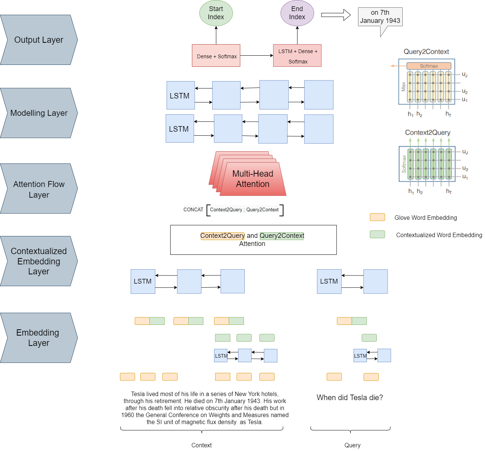

# MuBAF
## Multi-Head Bi-Directional Attention FLow For Machine Comprehension


### Set Up


1. Download Dataset, Pickle Files and Tag Files from OneDrive Link.
```shell
https://1drv.ms/u/s!AvQ-h7H-fCyHhnqf-Tjgp5A5d1iA?e=gvcZys
```
2. Install other dependencies
```shell
pip install -r requirements.txt
```
If download link doesn't work run shell script.
Note main.py won't run without downloading the pickle files from the OneDrive link.
3. Run Shell Script
```shell
sh download.sh
```
3. Run Model
```shell
python main.py
```

### Machine Comprehension Question Answering System

### Model Architecture

